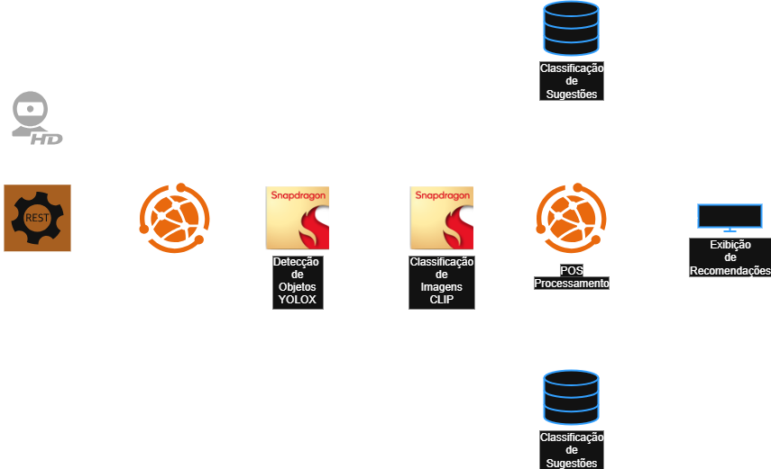

# Aura - API
## Advanced Retail User Assistant

API para **detecção** e **recomendação** de produtos no carrinho, criando relações entre itens para um fluxo de compra mais eficiente.  
Suporta **HTTP/2** (via Hypercorn) para melhor **streaming de frames**.

> Na **raiz do projeto** há uma coleção do Postman com requisições prontas: **`doc-postman-requests.json`**.

---


---

## Membros

- **Gabriel Alexandre Vieira** — <gabrielvieira840@gmail.com>  
- **Yan Vitor Santana de Almeida** — <yan.almeida91@hotmail.com>  
- **Cristiano Silva** — <ziwehdafe@gmail.com>  
- **Jessica Mello Pinheiro Leite** — <jessica.melloleite@gmail.com>  
- **Juliana Mello Pinheiro Leite** — <juliana.leiite@icloud.com>

---

## Componentes

- **Items**: cadastro de itens (nome + imagem) com *slug* normalizado (sem acento/espaco).  
- **Relateds**: relações “produto → relacionado” com `score` (ex.: *macarrão → molho de tomate*).  
- **Frames**: ingestão de quadros (arquivo/base64/URL) para detectar produtos em **área de interesse** usando modelo de visão computacional.  
- **Views HTML**: retorno em HTML (Jinja2) para “OFERTA!”/“aproveite !” com ou sem imagem do item.

Tecnologias principais:
- **FastAPI** (ASGI) — API  
- **MongoDB** (Motor async) — banco NoSQL (`items`, `relateds`, `products` de suporte)  
- **Jinja2** — renderização de HTML  
- **OpenCV headless** — utilitários de imagem/decodificação  
- **Hypercorn (HTTP/2)** e **Uvicorn (HTTP/1.1)**  
- (Opcional) **YOLO/CLIP** — detecção/classificação/embedding, via modelo ONNX

---

## Arquitetura (alto nível)



- **API** recebe *frames* + lista de produtos do carrinho → **Detector** → post-processa ROI → consulta **Relateds** → sugere **Item** → **HTML** (Jinja2) e/ou JSON.  
- **Uploads** de imagens de items servidos via `/static`.
````

---

## Pré-requisitos

- **Python 3.12+**
- **MongoDB 6/7/8+** (local ou container)
- Pacotes de sistema (quando necessário): `build-essential`

---

## Configuração (.env)

Crie **`.env`** (na raiz ou `app/.env`):

```env
API_PREFIX=/v1
MONGODB_URI=mongodb://localhost:27017
MONGODB_DB=narvalcart
UPLOAD_DIR=app/assets/uploads
PUBLIC_BASE_URL=http://localhost:8080
````

> `UPLOAD_DIR` é servido em `/static`.
> `PUBLIC_BASE_URL` é usado para montar URLs absolutas de imagem no HTML.

---

## Execução — Local (venv)

```bash
sudo apt update
sudo apt install -y python3.12-venv python3.12-dev build-essential

cd /caminho/do/projeto
python3 -m venv .venv
source .venv/bin/activate

pip install --upgrade pip setuptools wheel
pip install -r app/requirements.txt

# HTTP/1.1
python -m uvicorn app.main:app --host 0.0.0.0 --port 8080 --reload
```

### HTTP/2 (Hypercorn)

Melhor para **streaming de frames**:

```bash
pip install hypercorn h2

hypercorn app.main:app \
  --bind 0.0.0.0:8080 \
  --h2 \
  --certfile certs/dev.cert.pem \
  --keyfile certs/dev.key.pem
```

> Em produção, use certificados válidos ou um proxy/ingress com HTTP/2.

---

## Execução — Docker Compose

```bash
docker compose up -d --build
docker compose logs -f api
```

* API: `http://localhost:8080`
* Mongo: `mongodb://localhost:27017`

---

## Coleção Postman

Importe **`doc-postman-requests.json`** (na raiz) para testar todos os endpoints.

---

## Endpoints

### Items

| Método | Rota             | Descrição                                                                                 |
| -----: | ---------------- | ----------------------------------------------------------------------------------------- |
|   POST | `/v1/items`      | **form-data**: `name` (texto) + `file` (imagem). Cria/atualiza único registro por `slug`. |
|    GET | `/v1/items`      | Lista paginada. Query: `page`, `limit`, `q`.                                              |
| DELETE | `/v1/items/{id}` | Remove item pelo `id`.                                                                    |

> Regras: normaliza `name` → `slug`; se `slug` existir, **atualiza** doc e **substitui** a imagem (mantém 1 registro/imagem).

### Relateds

| Método | Rota                                    | Descrição                                                                      |
| -----: | --------------------------------------- | ------------------------------------------------------------------------------ |
|    PUT | `/v1/relateds`                          | Upsert parcial com payload: `{ "items": [ { "product","related","score" } ] }` |
|    GET | `/v1/relateds`                          | Lista paginada. Query: `page`, `limit`, `product`, `related`.                  |
| DELETE | `/v1/relateds/{id}`                     | Remove relação por `id`.                                                       |
|    GET | `/v1/relateds/suggest/html?product=...` | Retorna **HTML** (Jinja2) “OFERTA!”/“aproveite !” com/sem imagem do item.      |

### Frames

| Método | Rota         | Descrição                                                                   |
| -----: | ------------ | --------------------------------------------------------------------------- |
|   POST | `/v1/frames` | Processa um frame (base64 ou URL) + `cartProductIds` → detecção + relateds. |

**Exemplo (base64):**

```bash
b64=$(base64 -w 0 frame.jpg 2>/dev/null || base64 frame.jpg | tr -d '\n')
curl -X POST "http://localhost:8080/v1/frames" \
  -H "Content-Type: application/json" \
  -d '{"frame":{"encoding":"base64","data":"'"$b64"'"},"cartProductIds":["macarrão"]}'
```

---

## Exemplos (curl)

**Items — criar/atualizar (form-data)**

```bash
curl -X POST "http://localhost:8080/v1/items" \
  -H "Content-Type: multipart/form-data" \
  -F 'name=Queijo Parmesão' \
  -F 'file=@/caminho/para/imagem.jpg'
```

**Items — listar**

```bash
curl "http://localhost:8080/v1/items?page=1&limit=20&q=queijo"
```

**Items — deletar**

```bash
curl -X DELETE "http://localhost:8080/v1/items/ID_DO_ITEM"
```

**Relateds — upsert parcial**

```bash
curl -X PUT "http://localhost:8080/v1/relateds" \
  -H "Content-Type: application/json" \
  -d '{ "items": [ { "product": "macarrão", "related": "molho de tomate", "score": 0.9 } ] }'
```

**Relateds — listar**

```bash
curl "http://localhost:8080/v1/relateds?page=1&limit=20&product=macarrão"
```

**Relateds — deletar**

```bash
curl -X DELETE "http://localhost:8080/v1/relateds/ID_DA_RELACAO"
```

**Sugestão HTML (Jinja2)**

```bash
xdg-open "http://localhost:8080/v1/relateds/suggest/html?product=macarrão" 2>/dev/null || true
```

---

## Modelos de Dados (Mongo)

**`items`**

```json
{
  "_id": "...",
  "name": "Queijo Parmesão",
  "slug": "queijo-parmesao",
  "path": "app/assets/uploads/items/queijo-parmesao.jpg",
  "createdAt": "...",
  "updatedAt": "..."
}
```

**`relateds`**

```json
{
  "_id": "...",
  "product": "macarrão",
  "related": "molho de tomate",
  "score": 0.9
}
```

> Índices recomendados:
>
> * `items.slug` (único)
> * `relateds` em `(product, related)` (único) ou índice composto com `score` se necessário.

---

## Dicas & Solução de Problemas

* **Imagem não carrega no HTML**: confirme `PUBLIC_BASE_URL` e se `UPLOAD_DIR` é montado em `/static`.
* **Conflito de índices**: remova/ajuste índices antigos no Mongo (`db.collection.getIndexes()` / `dropIndex`).
* **HTTP/2**: use Hypercorn com `--h2` e **certificados** válidos (ou proxy TLS com h2).
* **OpenAPI**: auto-docs em `/docs` e `/redoc`.

---

## Licença

Distribuído sob **MIT**. Consulte o arquivo ****.

````
